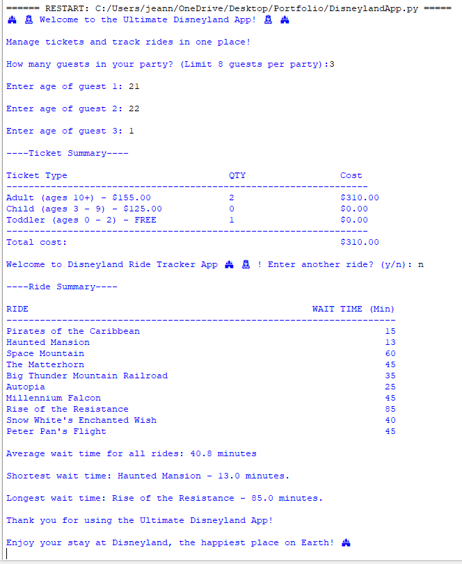

** 🎢 Ultimate Disneyland App (Educational Project)

A Python-based project created for a programming class, inspired by the theme park experience. This is an unofficial and educational simulation of ticketing and ride-tracking features.

** Skills Demonstrated **
- Python basics (input/output, data types, control flow)
- Lists and data aggregation
- Input validation and error handling
- Modular program structure
- User-friendly terminal UI

** Features **
- **Ticketing:** Calculates ticket costs for adults, children, and toddlers (limit 8 guests)
- **Ride Tracker:** Displays default rides, lets users add new rides, and shows average, shortest, and longest wait times

** How to Run **
1. Open `UltimateDisneylandApp.py` in IDLE or your terminal  
2. Enter the number of guests and their ages  
3. Add ride names and wait times when prompted  
4. View total cost, average waits, and ride summaries

** Example Output **
How many guests in your party? (Limit 8 guests per party): 4
Enter age of guest 1: 35
Enter age of guest 2: 33
Enter age of guest 3: 8
Enter age of guest 4: 1

Total cost = $435.00

Welcome to Disneyland Ride Tracker App! 🏰 Enter another ride? (y/n): y
Enter ride name: Space Mountain
Enter wait time for Space Mountain in minutes: 60
Enter another ride? (y/n): n

Average wait time for all rides: 30.0 minutes
Shortest wait: Haunted Mansion - 13 minutes
Longest wait: Space Mountain - 60 minutes

Enjoy your stay at Disneyland, the happiest place on Earth! 🏰✨

