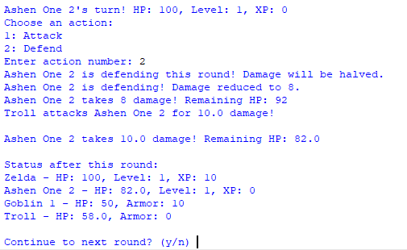
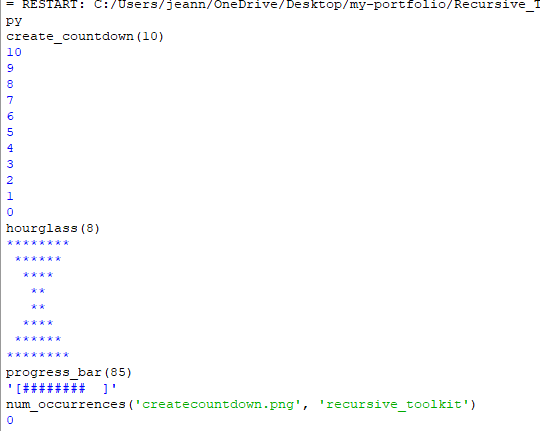
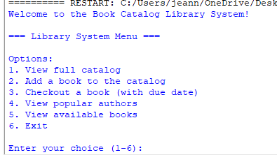
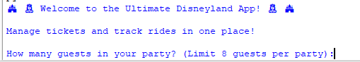
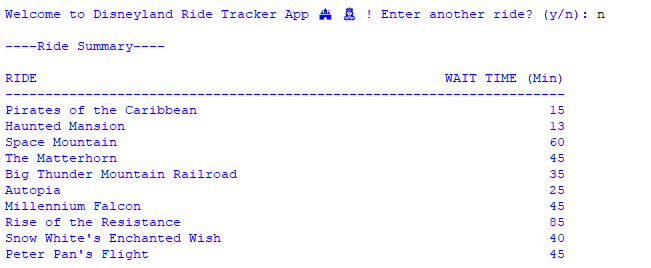
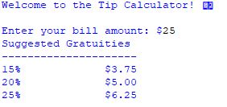

# My Coding Portfolio

Welcome! This portfolio showcases Python projects I’ve built, demonstrating problem-solving, data handling, and object-oriented programming skills. Each project includes code samples, screenshots, and usage instructions.

##  Projects

## RPG Character Simulator
A Python program that simulates characters, players, and enemies with combat mechanics, inheritance, and operator overloading. Includes refactoring of previous code for better modularity and readability.

[View project →](https://github.com/toombj95/my-portfolio/tree/main/RPG_Simulator)

## Recursive Toolkit
A collection of Python problems solved using recursion. Includes countdowns, hourglass printing, progress bars, and file occurrence counting.

[View project →](https://github.com/toombj95/my-portfolio/tree/main/Recursive_Toolkit)

## Book Catalog Library System
A Python program that allows users to manage a book catalog, track book checkouts, and calculate due dates. Users can view the full catalog, add new books, checkout books with due dates, and view popular authors.

[View project →](https://github.com/toombj95/my-portfolio/tree/main/Book_Catalog)

### Ultimate Disneyland App (Educational Project)
A Python-based project created for a programming class, inspired by the theme park experience. This is an unofficial and educational simulation of ticketing and ride-tracking features.
Combines ticketing and ride tracking in one Python program. Calculates ticket costs and tracks ride wait times.  

 

  

[View project →](https://github.com/toombj95/my-portfolio/tree/main/DisneylandApp)

### Tip Calculator
A Python program that calculates tips, handles bill splitting, and validates inputs.  

  

[View project →](https://github.com/toombj95/my-portfolio/tree/main/TipCalculator)

## Skills Demonstrated

- Python fundamentals: variables, loops, conditionals
- Functions with parameters and return values
- Dictionaries, sets, and tuples for data management
- Lists and advanced data structures
- Date handling using the datetime module
- Input validation and dynamic user input handling
- Modular program design and code reusability
- Object-Oriented Programming: Classes, Inheritance, Operator Overloading, Method Overriding
- Recursion and algorithmic problem solving
- File system handling (os module)
- Markdown for documentation

