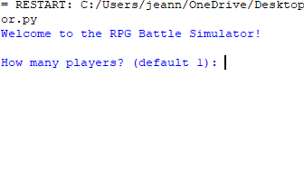
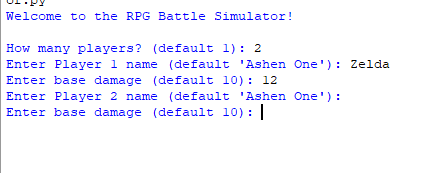
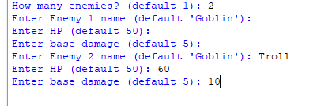
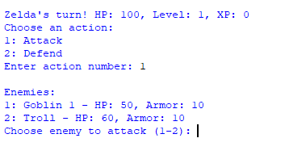

# ⚔️ RPG Battle Simulator


A turn-based, text-based Python battle simulator where players create heroes, battle enemies, gain XP, and level up.  

This project showcases **object-oriented programming**, **class inheritance**, and **interactive user input** in a console-based RPG environment.


## 🚀 Features

- 🎮 Interactive, turn-based combat between players and enemies  

- 💥 Player leveling system with XP gained from attacks and defeated enemies  

- 🧙‍♂️ Custom character creation (with default fallbacks)  

- 🛡️ Defend mechanic to halve incoming damage  

- 🧱 Enemy armor system that absorbs damage before HP loss  

- 📈 Automatic level-up system that increases stats dynamically  

- 🧩 Modular, object-oriented design with clean code and docstrings  

- 🖥️ Console-based interface for easy interaction  


## 🧩 Program Overview

### 1. Character Class (`Character`)

Base class for all characters in the game.  
Defines shared attributes (`name`, `level`, `hp`) and core functionality.  

**Key Features:**
- Inheritance base for `Player` and `Enemy`
- Combine characters using `__add__`
- Compare or print characters cleanly with `__str__`


### 2. Player Class (`Player`)

Represents the player-controlled character.  
Tracks experience points (XP), manages attacks, defenses, and leveling.  


**Attributes:**

&nbsp;	- `xp`: Experience points  
&nbsp;	- `base_damage`: Attack power that scales with level  
&nbsp;	- `defending`: Flag for reducing damage when defending  


**Key Methods:**

- `attack(target)`: Deals damage and grants XP per attack  
- `add_xp(amount)`: Increases XP and triggers level-ups  
- `level_up()`: Boosts HP and base damage  
- `take_damage(value)`: Reduces HP based on incoming attacks  


🧮 **XP System:**  

- +5 XP for each attack  
- +10 bonus XP for defeating an enemy  
- Level-up every 100 × current level XP  


### 3. **Enemy Class (`Enemy`)**

Represents AI-controlled foes with armor and attack power.  


**Attributes:**
- `armor`: Damage buffer before HP loss  
- `base_damage`: Attack power  


**Key Methods:**

- `attack(target)`: Attacks a random player  
- `deal_damage()`: Applies a class-based damage multiplier  
- `take_damage(value)`: Reduces armor first, then HP  


🧱 **Armor Mechanics:**  

Damage applies to armor first; only leftover damage reduces HP.  


### 4. **Battle Function (`battle(players, enemies)`)**

Runs the **interactive turn-based battle loop**.  
Players choose to **Attack** or **Defend** each round.  

**Flow:**

1. Each player takes a turn  
2. Enemies retaliate  
3. XP and bonus XP are awarded  
4. Status is displayed  
5. User decides to continue or quit  

The battle ends when all players or enemies are defeated.  


## 🧠 Skills Demonstrated
- **Object-Oriented Programming**: inheritance, polymorphism, and encapsulation  
- **Game Design Logic**: player/enemy turns, XP progression  
- **User Interaction**: input handling and real-time feedback  
- **Dynamic Lists**: tracking live player/enemy status  
- **Data Validation**: preventing invalid user choices  
- **Code Readability**: modular design and docstring documentation  


## ▶️ How to Run

1. **Install Python 3.8+**  
&nbsp;  Verify installation with:
&nbsp;  ```bash
&nbsp;  python --version

2. **Run the script**
- python RPGSimulator.py

Follow the prompts to create characters and start the battle.

## Example Run
Welcome to the RPG Battle Simulator!

How many players? 2



Enter Player 1 name (default 'Ashen One'): Zelda

Enter base damage (default 10):

Enter Player 2 name (default 'Ashen One'): Sonic

Enter base damage (default 10):



How many enemies? 2

Enter Enemy 1 name (default 'Goblin'): Oren

Enter HP (default 50):

Enter base damage (default 5):

Enter Enemy 2 name (default 'Goblin'): Troll

Enter HP (default 75):

Enter base damage (default 5):



--- Round 1 ---

Zelda's turn! HP: 100, Level: 1, XP: 0
Choose an action:
1: Attack
2: Defend
Enter action number: 1

Enemies:
1: Oren - HP: 50, Armor: 10
2: Troll - HP: 75, Armor: 10

Choose enemy to attack (1-2): 2



Zelda attacks Troll for 10.0 damage!
Zelda gains 5 XP! Total XP: 5


## 🏆 Future Enhancements
- 🎒 Add an inventory system for items and potions
- 🧙 Introduce classes (Mage, Warrior, etc.) with unique abilities
- 🗡️ Add weapon and armor upgrades
- 💾 Save/load player progress between sessions
- 🕹️ Implement a graphical (GUI) interface
- 📜 License

This project is open-source and free to use in personal or educational portfolios.

## 👨‍💻 Author
Developed by [J. Toombs] — A Python-based portfolio project demonstrating OOP and game design fundamentals.


