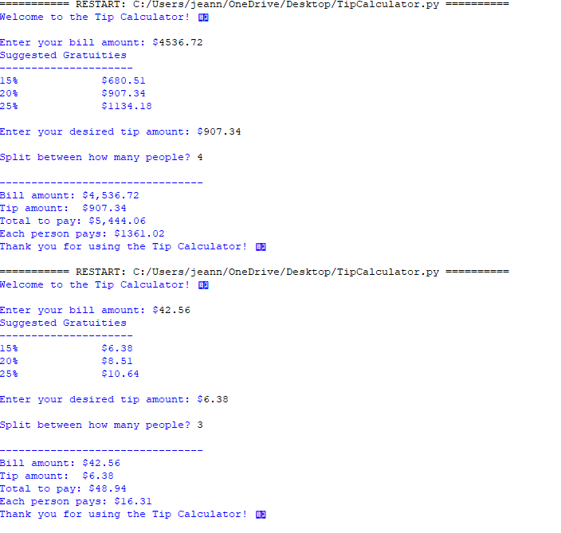

#Tip Calculator

A Python program that calculates tips for a given bill and supports splitting the total between multiple people.

## Features

- Calculates suggested tips (15%, 20%, 25%)

- Accepts custom tip input

- Handles bill splitting

- Input validation for positive numbers

- Supports large bill amounts with commas and dollar signs

##Screenshot

## How to Run

1. Make sure Python is installed on your computer.

2. Open `TipCalculator.py` in IDLE or your terminal.

3. Enter your bill amount, tip, and number of people when prompted.

Welcome to the Tip Calculator 💵

Enter your bill amount: $45.50

Suggested Gratuities

15%        $6.83

20%        $9.10

25%        $11.38

Please enter your tip amount =======> $10

Split between how many people? 2

Bill amount:      $45.50

Tip amount:       $10.00

Total to pay:     $55.50

Each person pays: $27.75

Thank you for using the tip calculator! 💵

